# Git Informe

## Introducción
 GitHub es una plataforma de alojamiento de código que utiliza el sistema de control de versiones Git. Permite a los desarrolladores colaborar en proyectos, gestionar cambios en el código fuente y mantener un historial detallado de modificaciones. Actualmente es una herramienta esencial en el desarrollo de software moderno y es la plataforma de control de versiones más popular del mundo.

 En este informe, exploraremos las características clave de GitHub, su historia, y cómo se utiliza en el desarrollo de software colaborativo y sus comandos más utilizados.

 ## ¿Qué es Git y GitHub?
 Git es un sistema de control de versiones distribuido que permite a los desarrolladores rastrear cambios en el código fuente a lo largo del tiempo. 

 ## Historia de Git
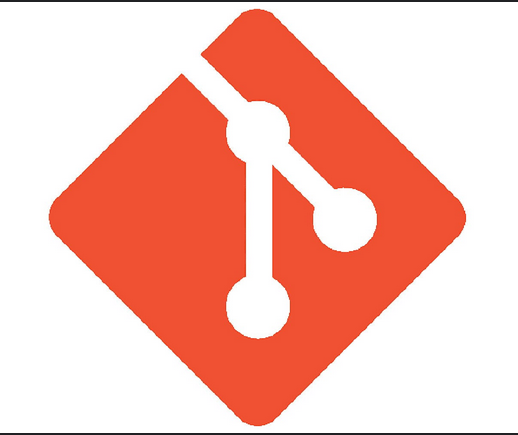
Git fue creado por Linus Torvalds en 2005 para gestionar el desarrollo del kernel de Linux. Fue diseñado para ser rápido, eficiente y soportar grandes proyectos con múltiples colaboradores. Git Hub fue lanzado en 2008 por Tom Preston-Werner, Chris Wanstrath y PJ Hyett como una plataforma basada en Git que facilitaba la colaboración y el alojamiento de repositorios.

## instalacion de Git Hub
para instalar Git Hub, primero se debe instalar Git en tu sistema. se puede descargar desde [git-scm.com](https://git-scm.com/) en caso de que tengas el sistema operativo de mac o linux no es necesario instalarlo por que ya lo incluye.
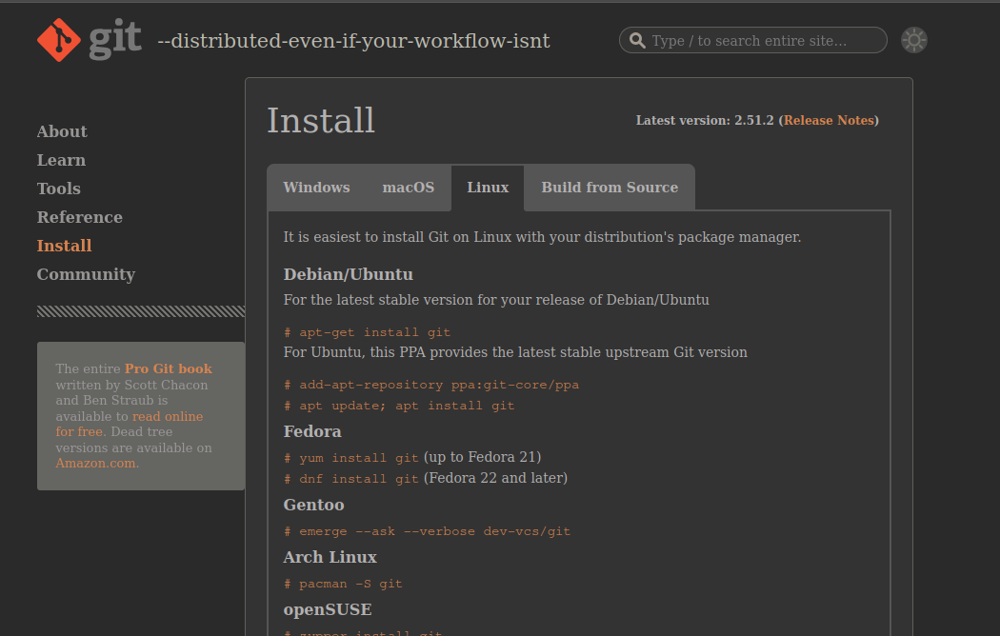
En mi caso yo no lo descargo porque ya lo tengo. Estos son los pasos para instalar Git en Windows:
1. descarga el instalador de Git desde [git-scm.com](https://git-scm.com/).
2. ejecuta el instalador y sigue las instrucciones en pantalla.
3. una vez instalado, abre la terminal de comandos (cmd) o Git Bash.
4. configura tu nombre de usuario y correo electrónico con los siguientes comandos:
   ```
   git config --global user.name "tu_nombre_de_usuario"
   git config --global user.email "tu_correo_electronico"
   ```

## Comandos Básicos de GitHub

### Comando: git
Este comando nos muestra una breve descripción de Git con sus comandos más utilizados.
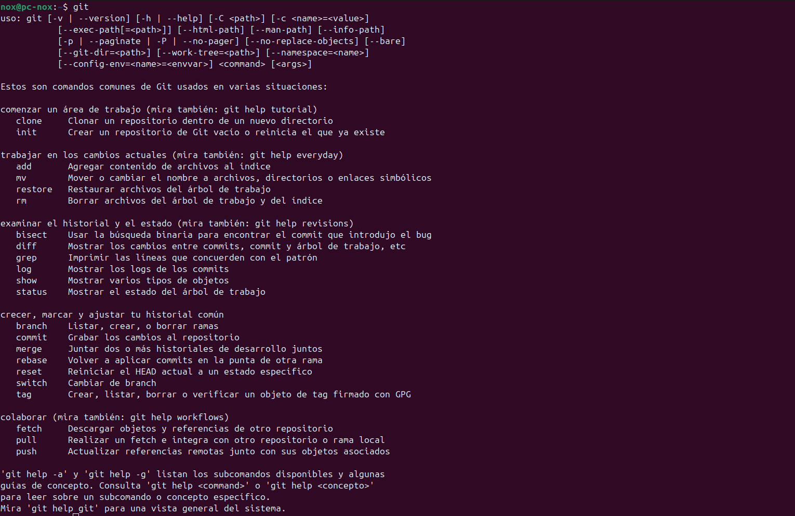

## Configuración de Git
primero tenemos que sber que es una rama en git, una rama es una version paralela del repositorio que permite trabajar en diferentes caracteristicas o correcciones de errores sin afectar la version principal del codigo. las ramas son fundamentales para el flujo de trabajo colaborativo en git hub, ya que permiten a los desarrolladores trabajar de manera independiente y luego fusionar sus cambios en la rama principal (generalmente llamada "main" o "master") cuando esten listos.

Para configurar GitHub en la terminal usamos los siguientes comandos:

### Comando: git config --global user.name
Este comando configura el nombre de usuario global para GitHub. Esto se hace si ya tienes una cuenta en GitHub.


### Comando: git config --global user.email
Este comando configura el correo electrónico global para GitHub.


### Comando: git config --list
Este comando muestra la configuración actual de GitHub.
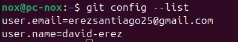

posteriormente inicalizamos un repositorio local, pero primero necesitamos crear una carpeta o utilizar una ya existente, en mi caso yo cree una de la siguiente manera:
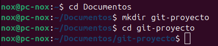
y tambien le creamos algunos archivos con el comando:
```touch archivo1.txt archivo2.txt```
asi:

Una vez posicionados en la carpeta, inicializamos el repositorio con los siguientes comandos:

### Comando: git init
Este comando inicializa un nuevo repositorio de Git en el directorio actual.


Ahora si vamos a nuestros documentos veremos que se creó una carpeta oculta llamada `.git` que es donde se almacenan todos los archivos necesarios para el repositorio.
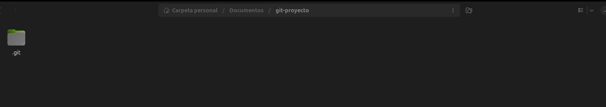

### Comando: git status
Este comando muestra el estado actual del repositorio, incluyendo archivos modificados y no rastreados.
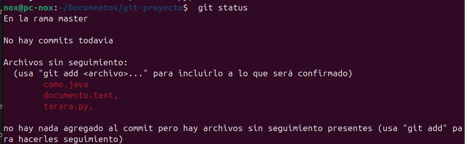

### Comando: git add
Este comando agrega un archivo al área de preparación.
```bash
git add como.java
```
ahora con el comando git status veremos que el archivo como.java ya esta en el area de preparacion.
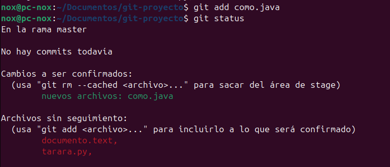 

### ¿Qué es un commit en GitHub?
Un commit en GitHub es una confirmación de cambios realizados en el código fuente. Cada commit representa un punto en el historial del proyecto, permitiendo a los desarrolladores rastrear y revertir cambios si es necesario. Un commit incluye un mensaje descriptivo que explica los cambios realizados, y se asocia con un identificador único (hash) que facilita su referencia.

### Comando: git commit
Este comando confirma los cambios en el repositorio con un mensaje descriptivo.
```bash
git commit -m "primer commit"
```
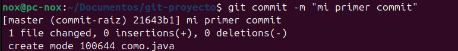

### ¿Qué es un log en GitHub?
El log en GitHub es un registro detallado de todos los commits realizados en un repositorio. Muestra información como el identificador único del commit (hash), el autor, la fecha y el mensaje del commit. El comando git log permite a los desarrolladores revisar el historial de cambios, facilitando la colaboración y la gestión del código fuente.

### Comando: git log
Este comando muestra el historial de confirmaciones en el repositorio.
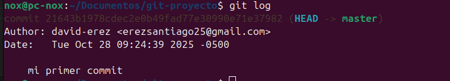

### Comando: git checkout
Este comando descarta los cambios en un archivo específico, restaurándolo a su estado en el último commit.
```bash
git checkout como.java
```


### Comando: git reset
Este comando deshace cambios en el área de preparación o en el directorio de trabajo.
```bash
git reset como.java
```
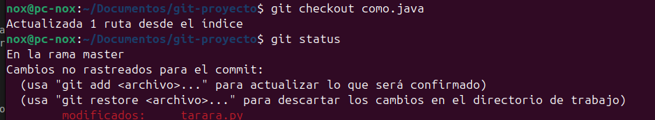

### Comando: git log --graph
Este comando muestra el historial de confirmaciones en el repositorio en forma de grafo.
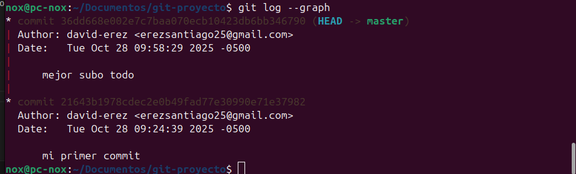
podriamos hacer que la informacion del log sea mas compacta con el siguiente comando:
 git log --oneline: este comando muestra el historial de confirmaciones en el repositorio en una sola linea por commit.
 git log --graph --pretty=oneline --abbrev-commit: este comando muestra el historial de confirmaciones en el repositorio en forma de grafo y en una sola linea por commit.
9.dentro de la configuracion de git podemos encontrar opciones para personalizar el comportamiento de git, como alias para comandos, configuraciones de usuario y preferencias de formato.
git config --global alias.wy "log --graph --decorate --oneline": este comando crea un alias llamado wy que muestra el historial de confirmaciones en el repositorio en forma de grafo y en una sola linea por commit.
```git wy
```


## git ignore
.gitignore es un archivo especial en un repositorio de git que especifica los archivos y directorios que git debe ignorar. esto es util para evitar que archivos temporales, archivos de configuracion local, archivos compilados y otros archivos no deseados se incluyan en el control de versiones. el archivo .gitignore contiene una lista de patrones que coinciden con los nombres de archivos o directorios que deben ser ignorados por git.

para crear un archivo .gitignore, simplemente crea un archivo de texto llamado .gitignore en la raiz de tu repositorio y agrega los patrones de los archivos o directorios que deseas ignorar. 
ahora ingresamos a un editor de texto para agregar los archivos que queremos ignorar, en mi caso usare el vscode:
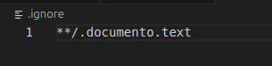
luego de agregar los archivos guardamos el archivo .gitignore y volvemos a la terminal para verificar el estado del repositorio con el comando git status:
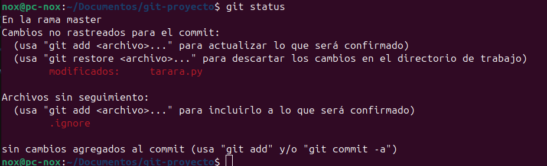
aca subimos los cambios:
```git add .gitignore
git commit -m "agregado archivo git ignore"
```
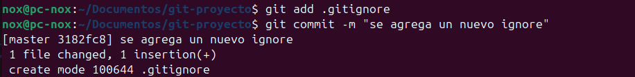

## git diff
git diff es un comando en git que muestra las diferencias entre archivos o confirmaciones. es util para revisar los cambios realizados en el codigo fuente antes de confirmarlos (commit) o para comparar diferentes versiones de un archivo. el comando git diff resalta las lineas que han sido agregadas, eliminadas o modificadas, facilitando la revision y el seguimiento de cambios en el proyecto.
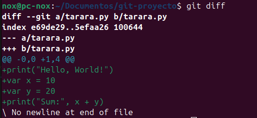 

## gti  reset --hard 
este comando nos permite aniquilar los commits, util para cuando se comete un error y lo mejor es no dejar rastro de el.
entoces utilizamos el comando de el cual hizimos un alias anteriormente y lo ejecutamos para saber el id de este .
 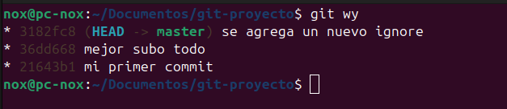
 aca tomamos el id en el que que queramos que este la cabeza y con el comando ```git reset --hard``` apuntamos hacia el.
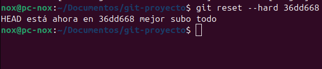
ahora si miramos la carpeta de nuestro proyecto veremos que no tenemos los cambios posteriores a el commit ```36dd668``` 

si por alguna razon nos equivocamos y queremos reestablecer aquellos commits que eliminamos, hacemos lo siguiente:
utilizamos el comando git ```reflog``` que es el historial de interaciones que hemos hecho en nuestro git,
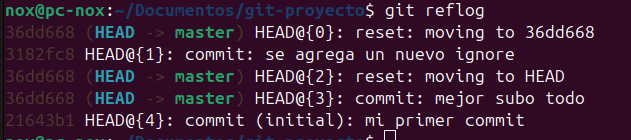
posteriormente utilizaremos el mismo comando anterior pero con el id que anteriormente era cabeza ```git checko 3182fc8```.
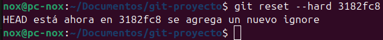
y por ultimo, para asegurarnos que recuperamos los datos ejecutamos el siguiente comando.
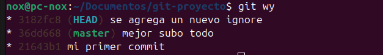
 
 ## git tag
 este comando nos ayuda a etiquetar commits, lo utilizamos para marcar verciones.
 con el siguiente comando podemos crear una etiqueta en el commit en el que estmos hubicados ```gti tag nombreEtiqueta```:
 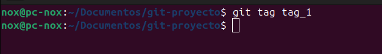
 y confirma mos con el ```git log```:
 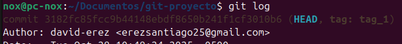
 ahora si agregamos un nuevo commit nuestra etiqueta no se vera alterada:
 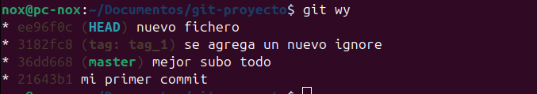
 si queremos saber cuales son todos nuestros tags utilizamos ```git tag```:
 
 si nos queremos movilizar de un commit a otro de una forma rapida utilizamos los tags:
 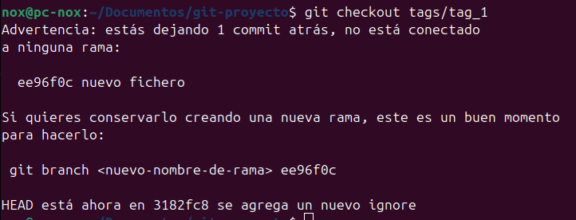w
 
 ## git branch
 una rama es cuando queremos hacer algo en nuestro prouyecto y ese algo no tiene sentido que lo hagmos en nuestra rama principal que vendria siendo el main esta se crea tomando como referencia todo el trabajo que teniamos en nuetra rama main.
 para crear una nueva rama utilizamos el comando ```git branch nombreRama```:
 
 con el anterior comando creamos la rama mas no estamos hubicados en ella, para eso utilizamos el comando ```git switch``` que es como el checkout pero con ramas:
 
 entonces si agregamos un nuevo commit podesmos ver que este sigue el flujo de la nueva rama que creamos:
 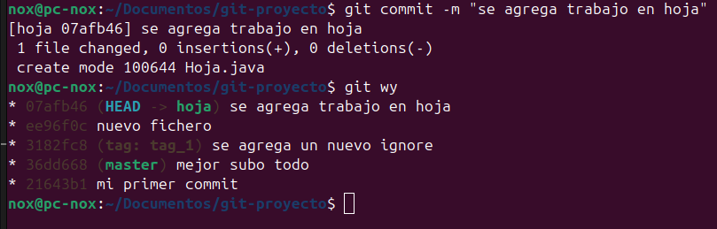

 ## gir merge
 con este comandi podemos fucionar dos ramas, inetegrando toodos los cambios en un solo flujo. para ello se tiene que tener en cuenta los comits ya que el git merge no permite fucionar si no hay cambios guardadado con un commit.
 para ello, hcimos un cambio en algun fichero de nuestro proyecto hubicados en el flujo princeipal.
 
 posteriormente nos hubicamos en la otra rama con el comando```git switch hoja``` y alli utilizamos el comando git merge:
 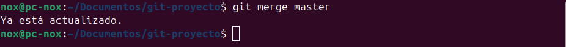

## conflictos en git  
algunaz veces tienden a fallar los marge esto cuando se mooifican lineas en los que otros grupos trabajan.

## git stahs 
imaginemos que estamos en medio de un desarrolo y se nos llama para trabajar en otra rama, este comando nos perimite para guardar cambios de forma rapida sin hacer commit, por ejemplo:
estamos trabajando en un fichero:
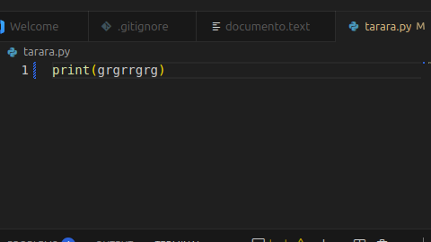
con el comando ```git stahs``` :
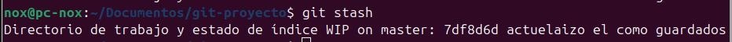
si queremos ver los guradados que tenemos hacemos el comando ``git stash list``
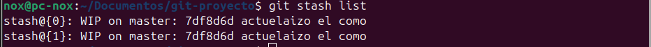
para recuperar esoos guradados por decirlo asi, utilizamos el siguiente comando ``git stash pop``
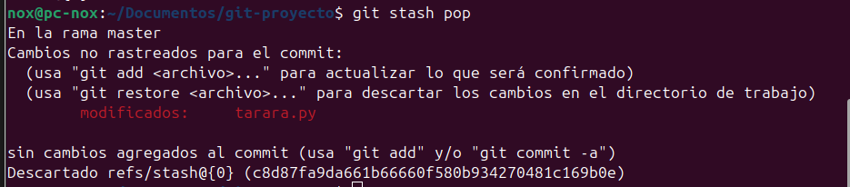

## eliminacion de ramas 

para eliminar una rama utilizamos el comando ``git branch -d ramaaborrar``
 
 
 ## ¿como creamos un repositorio en github?
 para este punto ya deberiamos de tener una cuenta creada en github, una vez en la pajina principal, nos redigiremos a la parte superior hizquierda y daremos click en `   ``new``
 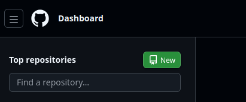
 eso nos digirira a la configuracion que queremos asignarle al repositorio:
 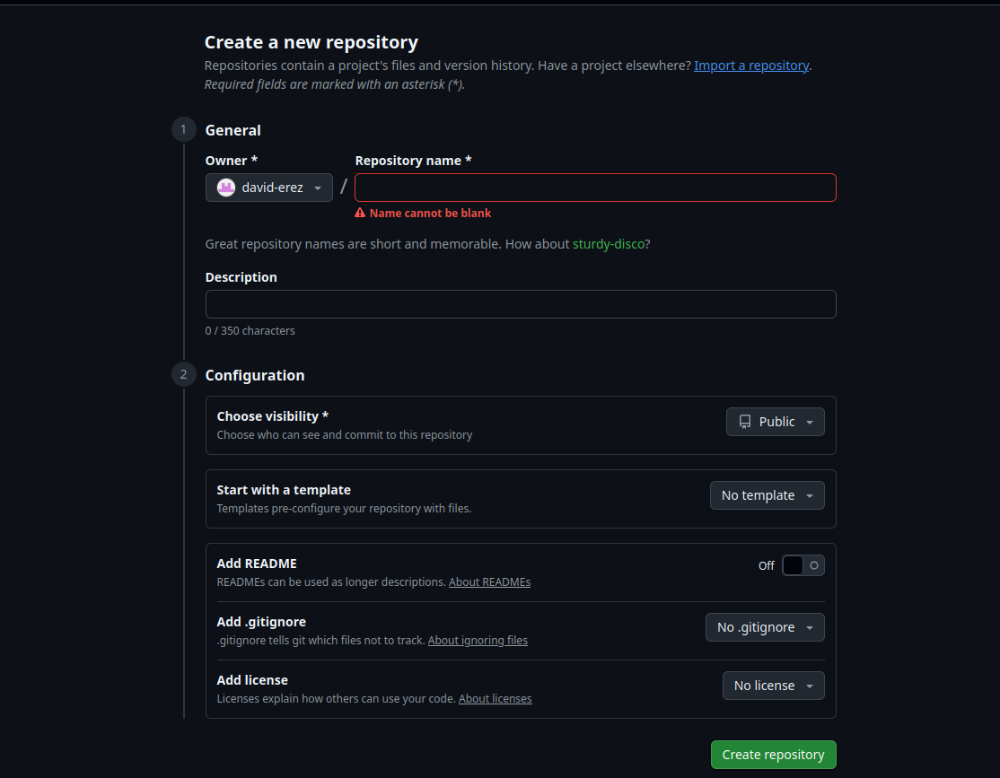
 aca si queremos pudemos hacer que el repositorio sea publico o privado, si escogemso privado solo nosotros y nuestros compañeros de trabajo podremos verlo, podemos agregar el archivo readme que sirve para dar una descripcion de lo que trata el proyecto, podemos agregar directamenete el gitignore y podremos tambien agregar una licencia.
 en mi caso yo lo deje asi:
 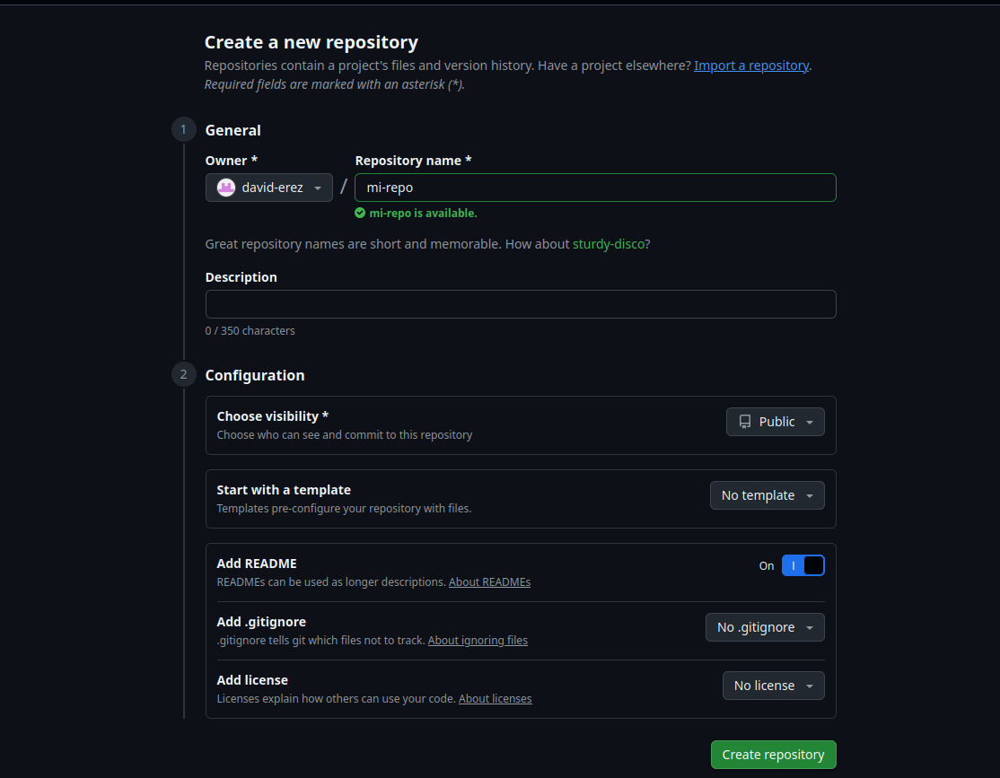
 posteriormente crearemos el repositorio opimiendo el boton berde en la parte inferior derecha:
 
 y de esa forma ya tendriamos creado nuestro repositorio remoto
 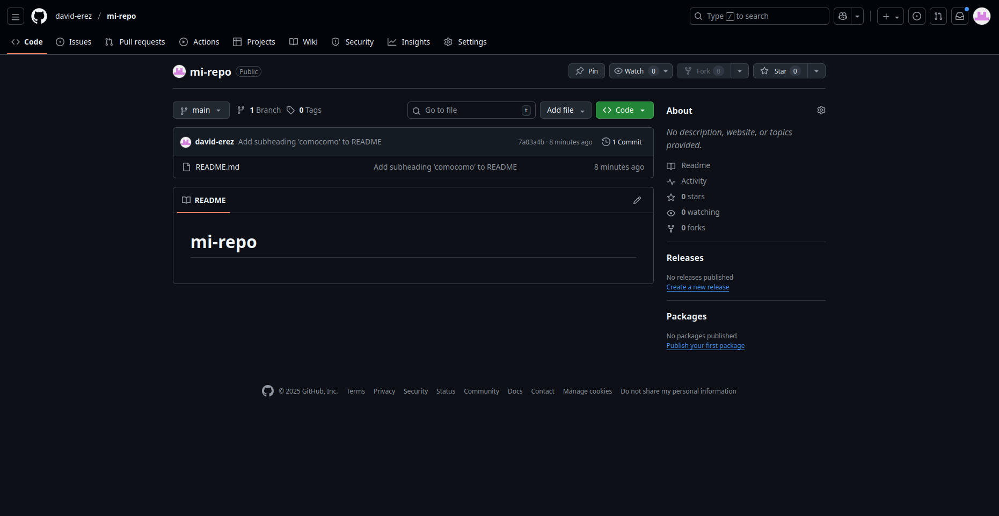

## como subimos unn proyecto a nuestro repositorio

para esto utilizaremos el proyecto con el q eu venimos trabajando anteriormente, posteriormente le daremos en el desplegable que dice code y copiaremos la url:
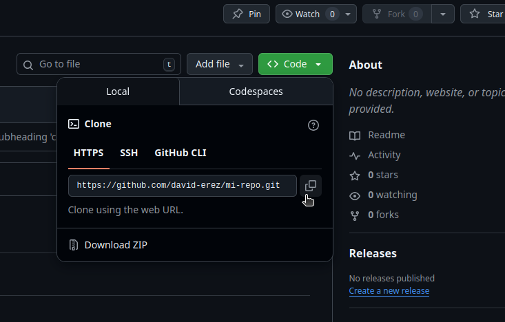
una vez copiada, regresamos a la consola y nos hubicamos en nuestro proyecto, alli ejecutaremos el siguiente comando ``git aremote add origin url``:

posteriormente utilizamos uno de los comando mas importantes de git el ``git push -u origin main`` , generealmente se coloca el main, pero como nosotro le hemos cambiado el nombre a hoja lo utilizaremos con hoja
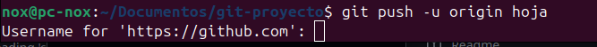
como puedes observar nos pide las credenciales de nuestra cuenta asi que se las daremos y de esa forma se subieron los archivos locales al repositorio.
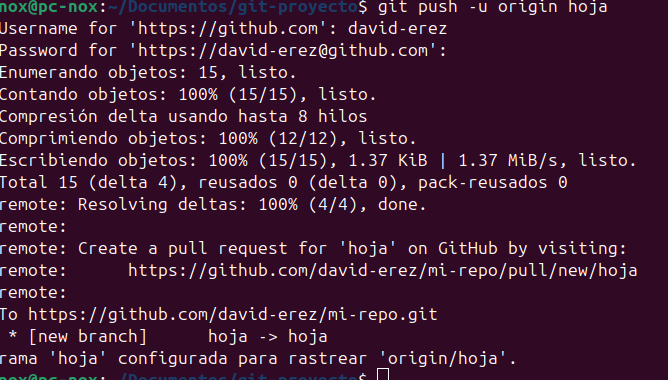
ahora si rerefrescamos la pagina de git hub podremos ver los cambios.

## git fetch 
ok, actualmente si modificamos una de las clases de nuestro proyecto e intentamos subirla con un `git push`nos saldra aun error, en tonces el  comando git fetch descarga los cambios de un repositorio remoto a tu repositorio local, actualizando las ramas de seguimiento remoto, pero sin fusionar automáticamente esos cambios en las ramas de trabajo locales. 
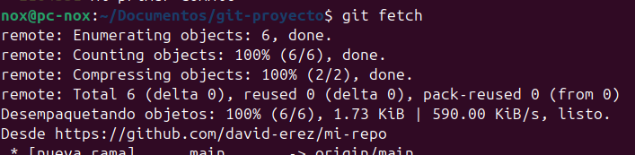
 ## git pull
 git pull descarga el histrorial y ambien los cambios de el github.
 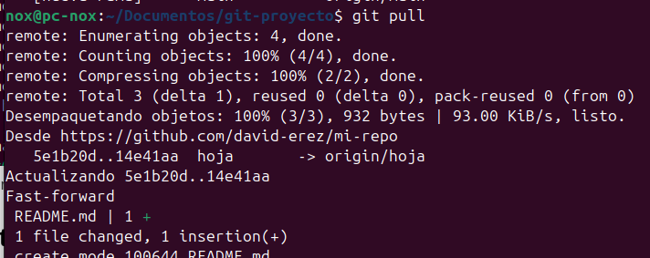 
 en este caso añadimos el archivo readme.md que creamos en github
 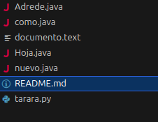

 ## git clone
 este comando sirve para clonar un repositorio en mi equipo local, primero nos hubicamos sobre una carpeta
 se utiliza de la siguiente manera:
 ``git clone url``
 la url es la misma que señale anteriormente para hacer el git push 

 ## git cherry-pick
 toma un commit concreto y lo trae e un nuevo commit de la rama actual
 `git cherry-pick `
 ## git rebase 
 esto trae una rama a la rama princicpal.
 `git rebase `

## GitHub Fork
Un fork es una copia independiente de un repositorio completo. Es una característica que permite a los usuarios copiar un repositorio existente a su propia cuenta de GitHub, lo que les permite hacer modificaciones sin afectar al repositorio original. Los forks son muy útiles para:
- Proponer cambios a proyectos de otros desarrolladores
- Usar el proyecto de alguien más como punto de partida para una nueva idea
- Contribuir a proyectos de código abierto

### Cómo hacer un fork
1. Navega al repositorio que deseas bifurcar en GitHub
2. Haz clic en el botón "Fork" en la esquina superior derecha
3. Selecciona tu cuenta como destino del fork

## Pull Request
Un Pull Request (PR) es una propuesta para integrar cambios de una rama a otra, típicamente de un fork a un repositorio original. Es la manera formal de contribuir a proyectos y colaborar con otros desarrolladores. Un PR puede incluir:
- Descripción detallada de los cambios realizados
- Discusiones sobre el código
- Revisiones de código por parte de otros desarrolladores
- Pruebas automáticas

### Cómo crear un Pull Request
1. Realiza tus cambios en tu fork del repositorio
2. Ve a la página del repositorio original
3. Haz clic en "Pull Requests"
4. Selecciona "New Pull Request"
5. Elige la rama base y la rama con tus cambios
6. Describe tus cambios y crea el PR

## Resolución de Conflictos
Los conflictos en Git ocurren cuando dos ramas tienen cambios diferentes en la misma línea de código y Git no puede determinar automáticamente cuál versión mantener. Esto es común cuando:
- Múltiples desarrolladores modifican el mismo archivo
- Se intentan fusionar ramas con cambios incompatibles
- Se intenta integrar cambios remotos que colisionan con cambios locales

### Cómo resolver conflictos
1. Git marcará los archivos con conflictos
2. Abre los archivos marcados y busca las secciones marcadas con:
   ```
   <<<<<<< HEAD
   tus cambios
   =======
   cambios de otra rama
   >>>>>>> nombre-rama
   ```
3. Edita el archivo para mantener los cambios deseados
4. Elimina los marcadores de conflicto
5. Guarda el archivo
6. Añade los archivos resueltos con `git add`
7. Completa el merge con `git commit`

### Consejos para evitar conflictos
- Mantén tus ramas actualizadas con la rama principal
- Comunícate con tu equipo sobre qué archivos están siendo modificados
- Divide el trabajo en módulos independientes cuando sea posible
- Realiza commits pequeños y frecuentes

## Herramientas gráficas:
* github desktop, herramienta que tiene conceptos basiscos pero se queda corta frente a proyectos mas complejos.
*gitkraken, esta herramienta es mas potenete que githut desktop pues gitkreennos permite hacer multiples cosas de forma dinamica
